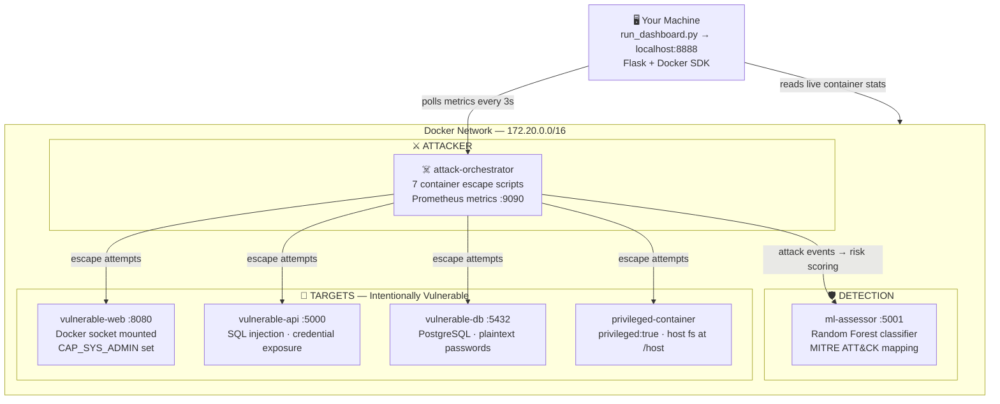

# Container Security Attack & Detection System

A hands-on container security platform that simulates real-world Docker-specific attacks, assesses risk using a machine learning model, and visualizes everything in a live analyst dashboard. Built to demonstrate deep understanding of container threat vectors, Linux primitives, and security tooling.

---

## Project Description

This system runs 7 container-specific attacks inside an isolated Docker environment — targeting Docker socket exposure, Linux namespace isolation, cgroup resource limits, Linux capabilities, container network topology, image supply chains, and privileged container escape. Each attack is mapped to MITRE ATT&CK, scored by a Random Forest ML classifier, and surfaced in a real-time dashboard that pulls live metrics directly from the Docker daemon.

The dashboard is a standalone Python/Flask server that runs on your machine (not inside Docker), polls the attack orchestrator's Prometheus metrics endpoint every 3 seconds, and re-renders the UI without any page reload.

---

## Key Features

- **7 container-specific attacks** — Docker socket escape, privileged container escape, namespace manipulation, resource abuse, network lateral movement, capability abuse, image/registry supply chain attack
- **Real-time dashboard** — auto-refreshes every 3 seconds, zero page reloads, live Docker container metrics (CPU, memory, network, disk I/O)
- **ML risk scoring** — Random Forest classifier scores each attack across 5 weighted features; contributions sum exactly to the displayed score
- **MITRE ATT&CK mapping** — every attack linked to technique IDs (T1611, T1496, T1046, T1525, T1055, T1068) with direct links to attack.mitre.org
- **Expandable attack detail** — click any row in the dashboard to see attack mechanics, MITRE mapping, and a full risk level breakdown with progress bars
- **Vulnerable enterprise environment** — e-commerce web app, payment API, PostgreSQL database, and a privileged container as realistic targets

---

## Architecture



<p align="center"><em>Figure 1 — System Architecture</em></p>

**Flow 1 — Dashboard polling:** `run_dashboard.py` on your host connects to Docker Desktop via the Docker SDK and polls `attack-orchestrator:9090/metrics` every 3 seconds. The frontend JS re-renders all tables and charts in-place with no page reload.

**Flow 2 — Attack execution:** `attack-orchestrator` runs 7 Python attack scripts sequentially. Each script targets a specific container security primitive (socket, namespace, cgroup, capability, network, image layer). On completion, each attack POSTs its result to the local Prometheus metrics exporter.

**Flow 3 — Metrics export:** The metrics exporter (Flask on port 9090) maintains Prometheus counters for attack type, status, duration, and last-seen timestamp. The dashboard reads these on every poll cycle.

**Flow 4 — ML scoring:** `ml-assessor` (port 5001) runs a Random Forest classifier that scores each attack across 5 weighted features. The dashboard derives the final risk score directly from the feature sum so the math is always transparent and verifiable.

**Flow 5 — Target containers:** `vulnerable-web`, `vulnerable-api`, `vulnerable-db`, and `privileged-container` are intentionally misconfigured targets. The web app has the Docker socket mounted and `CAP_SYS_ADMIN` set. The privileged container runs with `privileged: true` and the host filesystem mounted at `/host`.

---

## Tech Stack

| Layer | Technology |
|---|---|
| Dashboard server | Python 3, Flask, flask-cors |
| Docker integration | Docker SDK for Python (`docker`) |
| ML model | scikit-learn (Random Forest), numpy, pandas |
| Metrics | Prometheus client (prometheus-client) |
| Attack scripts | Python 3, requests, psutil |
| Vulnerable apps | Flask (web + API), PostgreSQL 13 |
| Infrastructure | Docker Desktop, Docker Compose |
| Frontend | Vanilla JS, SVG (donut chart), HTML/CSS |

---

## Setup Instructions

### Prerequisites

**1. Docker Desktop**

Download and install Docker Desktop for your OS:
- Windows / macOS: https://www.docker.com/products/docker-desktop
- Linux: `curl -fsSL https://get.docker.com | sh`

After installing, open Docker Desktop and make sure it is **running** (whale icon in system tray / menu bar).

Verify:
```bash
docker --version
docker compose version
```

Both commands must return a version number. If `docker compose` fails, you may have an older install — use `docker-compose` (with hyphen) instead throughout these instructions.

**2. Python 3.9+**

The dashboard runs directly on your machine, not inside Docker.

- Windows: https://www.python.org/downloads/ — check "Add Python to PATH" during install
- macOS: `brew install python` or download from python.org
- Linux: `sudo apt install python3 python3-pip` (Ubuntu/Debian)

Verify:
```bash
python --version   # or python3 --version
pip --version      # or pip3 --version
```

**3. Git**

- Windows: https://git-scm.com/download/win
- macOS: `xcode-select --install`
- Linux: `sudo apt install git`

---

### Step 1 — Clone the repository

```bash
git clone <repository-url>
cd <repository-folder>
```

Replace `<repository-url>` with the actual GitHub URL and `<repository-folder>` with the folder name it clones into.

---

### Step 2 — Install dashboard Python dependencies

The dashboard (`run_dashboard.py`) runs on your host machine and needs three packages:

```bash
pip install flask flask-cors docker
```

If `pip` is not found, try `pip3`. On Linux you may need `pip3 install --user flask flask-cors docker`.

Verify the install worked:
```bash
python -c "import flask, flask_cors, docker; print('OK')"
```

You should see `OK`. If you see an import error, re-run the pip install command.

---

### Step 3 — Build and start all Docker containers

This builds all container images and starts them in the background. The first run downloads base images and installs dependencies — expect 5–10 minutes.

```bash
docker compose up -d --build
```

> **Windows users:** Run this in PowerShell or Command Prompt, not Git Bash (Docker socket path issues).

Wait for the command to finish. You should see output ending with lines like:
```
✔ Container vulnerable-db        Started
✔ Container vulnerable-web       Started
✔ Container vulnerable-api       Started
✔ Container privileged-container Started
✔ Container attack-orchestrator  Started
✔ Container ml-assessor          Started
```

Verify all 6 containers are running:
```bash
docker ps
```

You should see all 6 containers with status `Up`. If any show `Exited`, see Troubleshooting below.

---

### Step 4 — Wait for services to initialize

The attack orchestrator and ML assessor need ~15 seconds to fully start their internal servers.

```bash
# Windows PowerShell:
Start-Sleep -Seconds 20

# macOS / Linux:
sleep 20
```

Confirm the metrics endpoint is live:
```bash
# Windows PowerShell:
Invoke-WebRequest -Uri http://localhost:9090/health -UseBasicParsing

# macOS / Linux:
curl http://localhost:9090/health
```

Expected response: `{"status": "healthy"}`

If you get a connection error, wait another 10 seconds and try again.

---

### Step 5 — Start the dashboard

Open a terminal in the project root folder and run:

```bash
python run_dashboard.py
```

> On macOS/Linux use `python3 run_dashboard.py` if `python` points to Python 2.

You should see:
```
✓ Connected to Docker Desktop
======================================================================
🛡️  Container Security Dashboard
======================================================================
Dashboard: http://localhost:8888
```

Leave this terminal open — the dashboard server must keep running.

Open your browser and go to: **http://localhost:8888**

You will see the dashboard with empty tables and dashes in the stat cards. That is correct — no attacks have run yet.

---

### Step 6 — Run the attack simulation

Open a **second terminal** (keep the dashboard terminal running) and execute:

```bash
docker exec attack-orchestrator python3 /attacks/run_all_attacks.py
```

This runs all 7 attacks sequentially inside the `attack-orchestrator` container. Each attack prints detailed output. The full simulation takes approximately 2–3 minutes.

You will see output like:
```
CONTAINER ATTACK: Docker Socket Escape
...
ATTACK SUCCESSFUL: Container Escape via Docker Socket
...
[✓] Metrics recorded for Docker Socket Escape
```

While the attacks run, switch back to your browser at **http://localhost:8888** — the dashboard will populate with data within 3 seconds of each attack completing, automatically, with no refresh needed.

---

### Step 7 — Explore the dashboard

Once all attacks complete you will see:

- **Stats bar** — total attack types, success rate, critical/high risk counts
- **Attack Distribution** — donut chart with MITRE IDs on each slice
- **Risk Assessment table** — click any row to expand a 3-column detail panel showing attack mechanics, MITRE ATT&CK links, and the ML risk score breakdown
- **Affected Infrastructure table** — live CPU/memory metrics per container, with `i` buttons for impact details
- **Footer** — live dot + last updated timestamp confirming auto-refresh is active

---

### Re-running attacks

The Prometheus counters live in the `attack-orchestrator` container's memory. To reset to zero and run a fresh simulation:

```bash
# Restart the container (resets all counters)
docker compose restart attack-orchestrator

# Wait ~15 seconds for the metrics server to come back up
# Then run attacks again:
docker exec attack-orchestrator python3 /attacks/run_all_attacks.py
```

---

### Running individual attacks

```bash
docker exec attack-orchestrator python3 /attacks/1_docker_socket_escape.py
docker exec attack-orchestrator python3 /attacks/2_privileged_container_escape.py
docker exec attack-orchestrator python3 /attacks/3_namespace_manipulation.py
docker exec attack-orchestrator python3 /attacks/4_resource_abuse.py
docker exec attack-orchestrator python3 /attacks/5_container_network_attacks.py
docker exec attack-orchestrator python3 /attacks/6_capability_abuse.py
docker exec attack-orchestrator python3 /attacks/7_image_registry_attacks.py
```

---

### Stopping everything

```bash
# Stop all containers (preserves data)
docker compose down

# Stop and wipe all container data
docker compose down -v
```

To stop the dashboard, press `Ctrl+C` in the terminal running `run_dashboard.py`.

---

## Troubleshooting

**Dashboard shows "No attacks detected yet"**

The dashboard is running but no attacks have been recorded. Run Step 6.

**`docker exec` says container not found**

The container may have exited. Check:
```bash
docker ps -a
```
If `attack-orchestrator` shows `Exited`, restart it:
```bash
docker compose up -d attack-orchestrator
```
Wait 15 seconds, then re-run the attacks.

**Port already in use (8888, 9090, 5000, 5001, 8080, 5432)**

Another process is using that port. Find and stop it:
```bash
# Windows PowerShell:
Get-NetTCPConnection -LocalPort 8888 | Select-Object OwningProcess

# macOS / Linux:
lsof -i :8888
```
Or change the conflicting port mapping in `docker-compose.yml` (left side of `host:container`).

**`pip install` fails or packages not found**

Try:
```bash
python -m pip install flask flask-cors docker
```

**Docker Desktop not connecting**

Make sure Docker Desktop is open and the whale icon shows "Docker Desktop is running". On Windows, ensure WSL 2 backend is enabled in Docker Desktop settings.

**`docker compose` not found**

Try `docker-compose` (with hyphen). If neither works, reinstall Docker Desktop.

---

## Security Notice

This project contains intentionally vulnerable containers and executes real container escape techniques. Run only in an isolated local environment. Never deploy on a production system or a network with sensitive data.
